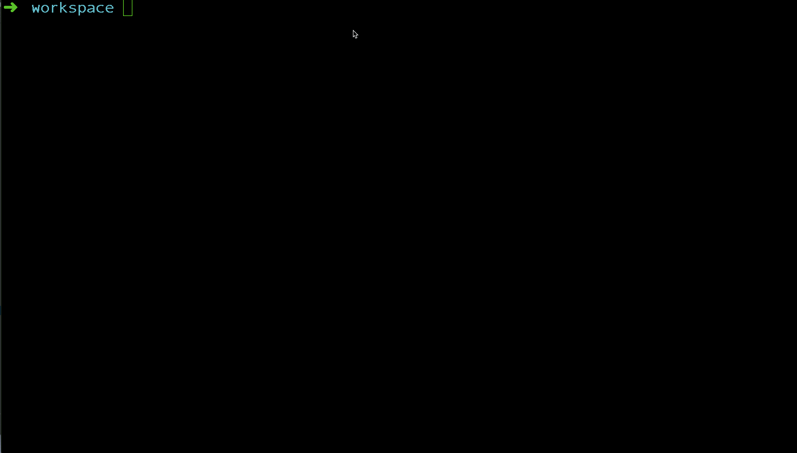

Manalize
=========

[](https://travis-ci.org/manala/manalize)

This project provides ready-to-use development environments for various projects (Symfony projects, custom apps, etc.).

At this moment, provided environments are based on Vagrant and provisioned through [Manala ansible roles](http://www.manala.io/).  
Some Docker based implementations are planned and should appear really soon.

Why?
----

Because we are too lazy for manually setting up local development environments for each project we have to work on.
In short, we need to:

- Be able to work on any new/existing project from any platform in minutes
- Enable/disable support for language, package or any various utility as well
- Keep a local environment consistent across projects (practices, tools)
- Have a local environment as close as possible from the production one
- Destroy/rebuild any environment as needed

What's inside?
--------------

Manalize is built on the shoulders of the following libs :

- [Composer Semver](https://github.com/composer/semver)
- [Guzzle](https://github.com/guzzle/guzzle)
- The Symfony [Console](https://github.com/symfony/console), [Process](https://github.com/symfony/process), [Filesystem](https://github.com/symfony/filesystem) and [Yaml](https://github.com/symfony/yaml) components

Prerequisites
-------------

- [PHP](http://php.net) 7.0+
- [Vagrant](https://www.vagrantup.com/) 1.8.4+
- [Vagrant Landrush](https://github.com/vagrant-landrush/landrush) 1.0+
- [VirtualBox](https://www.virtualbox.org/) 5.0.20+

Installation
------------

#### Using the installer (recommended):
```
$ curl -LSs https://raw.githubusercontent.com/manala/manalize/master/installer.php | php
```

#### Using composer:
```
$ composer global require manala/manalize
```

#### Using git:
```
$ git clone git@github.com:manala/manalize
$ cd manalize
$ composer install
$ make build
$ mv manalize.phar /usr/local/bin/manalize
$ chmod a+x /usr/local/bin/manalize
```

Usage
-----

### Checking that your host meets our requirements

Before using `manalize`, you need to ensure that your host is ready. It can easily be achieved by running the following command:

```sh
$ manalize check:requirements
```

A list of requirements and recommendations will be shown, sort as you can install/update packages depending on your need and the current state of your host.

### Setting up your environment

Given you have a web project that you clone for the first time and you need to run locally, simply execute the `setup` command:

```sh
$ manalize setup ~/my-awesome-app
```



This command interactively configures the virtual machine for your project.  
Some files will be added to your project:

- A `Vagrantfile`
- A `Makefile` including some useful tasks that you'll need to use throughout your project
- An `ansible/` directory containing all the configuration related to the VM provisioning
- Eventually some files specific to the chosen environment

Once this step done, your environment is ready so you can provision your VM using the following command:

```sh
$ make setup
```

### Working with your environment

Once the [`setup`](#setting-up-your-environment) process is finished (it may take a few minutes), your environment is operational and your VM is running.
To manage it and work with it, just use the `vagrant` command-line tool as usual:

```sh
$ vagrant up|halt|reload|ssh
```


### Keeping your environment up-to-date

Given your project's environment is there and your VM works well, its configuration is sticked to what we provided at the moment you created it.  
Since the [manala ansible roles](http://manala.io/) evolve (and the corresponding templates as well), you may want to be aware of the important changes made to in order to update your environment accordingly.

To do so, there are two commands to be aware of: `self-update` and `diff`.

#### self-update

```sh
$ manalize self-update
```

Running this command updates your `manalize` binary to the latest release, coming with the latest configuration templates.
After that, you can safely use the `diff` command as shown below.

#### diff

The `diff` command allows you to get a patch representing the diff between your current project configuration and the one that your current version of the `manalize` binary would have provided.

Getting the diff:
```
$ manalize diff ~/my-awesome-app
```

Getting the diff for applying the patch immediately:
```
$ cd ~/my-awesome-app
$ manalize diff | git apply
```

Getting the diff for applying the patch later:
```
$ cd ~/my-awesome-app
$ manalize diff > manalize.patch
$ git apply manalize.patch
```

_Note:_
  
> :warning: Be careful when applying the patch, any custom change made to your environment configuration will be erased.
To minimize risks, we recommend you to look at the patch before trying to apply it. 

### Updating an existing environment without immediatly altering its configuration

Sometimes, it can be useful to setup the environment without affecting the existing project files nor adding new ones, when migrating a project which already uses Vagrant and/or Ansible for instance. 

The following command will only update the `ansible/.manalize` metadata file from what you will configure:

```
$ manalize setup --no-update ~/my-awesome-app
```

So you can then apply a patch provided by the [diff](#diff) command.

Troubleshooting
---------------

Before all, please [ensure your host satisfies each of our requirements](#checking-that-your-host-meets-our-requirements). Your issue(s) may result from unsupported or buggy versions of packages installed on your machine.

If it doesn't, please consider [opening an issue](https://github.com/manala/manalize/issues/new) on this repository.
We use github issues for tracking bugs, feature requests and ensuring support.

License
-------

This project is licensed under MIT.  
For the whole copyright, see the [LICENSE](LICENSE) file distributed with this source code.

Contribute
----------

## How to run

```shell
    cd <path-to-your-awesome-project-root-dir>
    <path-to-manalize-root-dir>/bin/manalize setup .
```

## How to test

```shell
    cd <path-to-manalize-root-dir>
    make test
```

Author information
------------------

Manala (http://www.manala.io/)
